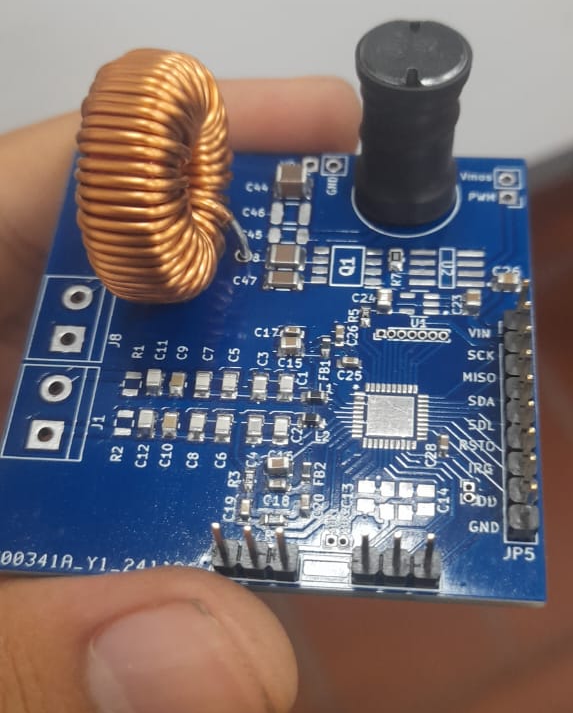

Simultaneous Wireless Power Transfer and Near Field Communication.

Este trabajo de grado presenta el diseño e implementación de un sistema capaz de integrar la transferencia inalámbrica de energía (WPT) y la comunicación por campo cercano (NFC) en la plataforma PhenoAgro, utilizada para la fenotipificación de cultivos en entornos agrícolas. Este trabajo de grado nace de la necesidad de sustituir el actual sistema de comunicación y potencia de la estación de PhenoAgro que funciona mediante pines metálicos, el cual presenta problemas de durabilidad y confiabilidad bajo condiciones ambientales adversas. La solución propuesta permite transmitir energía y datos de manera simultánea entre módulos mediante acoplamiento inductivo, reduciendo la vulnerabilidad mecánica y aumentando la robustez del sistema. El desarrollo incluye la implementación de inductores aptos para Transmisión de potencia inalámbrica (WPT) y Comunicación por Campo cercano (NFC), considerando factores como coeficiente de acoplamiento, factor de calidad, Skin effect y efecto proximidad, junto con un protocolo NFC para garantizar una comunicación estable. Además, se detalla el proceso de diseño e implementación de circuitos de compensación, inversores Clase E y rectificadores de alta eficiencia. Finalmente, Se realizaron simulaciones y validaciones experimentales que demuestran la viabilidad del sistema, alcanzando niveles de eficiencia superiores al 50 % en la transferencia de potencia del sistema completo con todas sus etapas. Esta propuesta contribuye a mejorar la robustez, confiabilidad y sostenibilidad de sistemas IoT aplicados en la agricultura de precisión en ambientes extremos.

